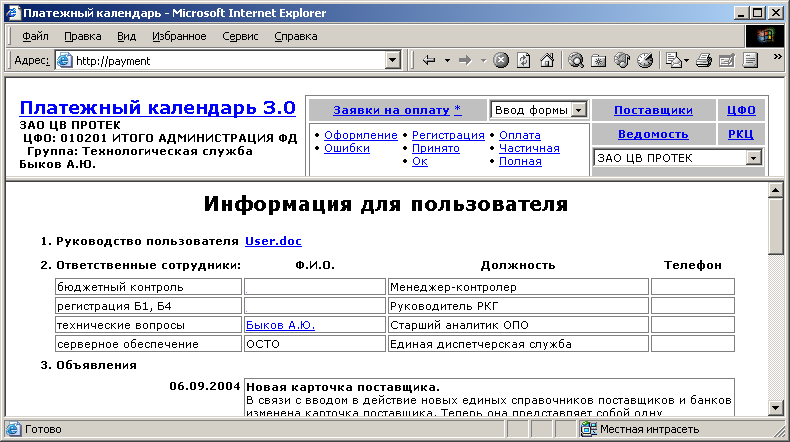
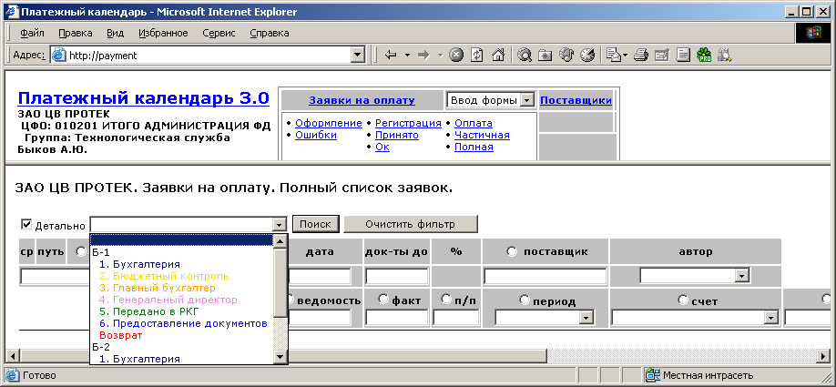
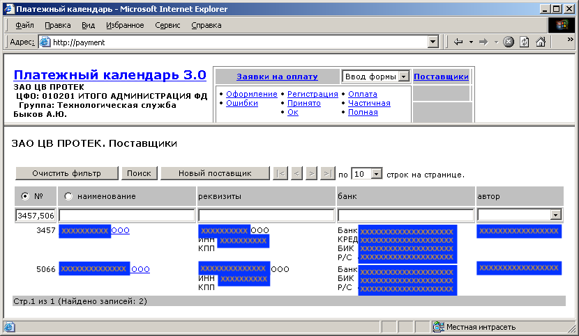
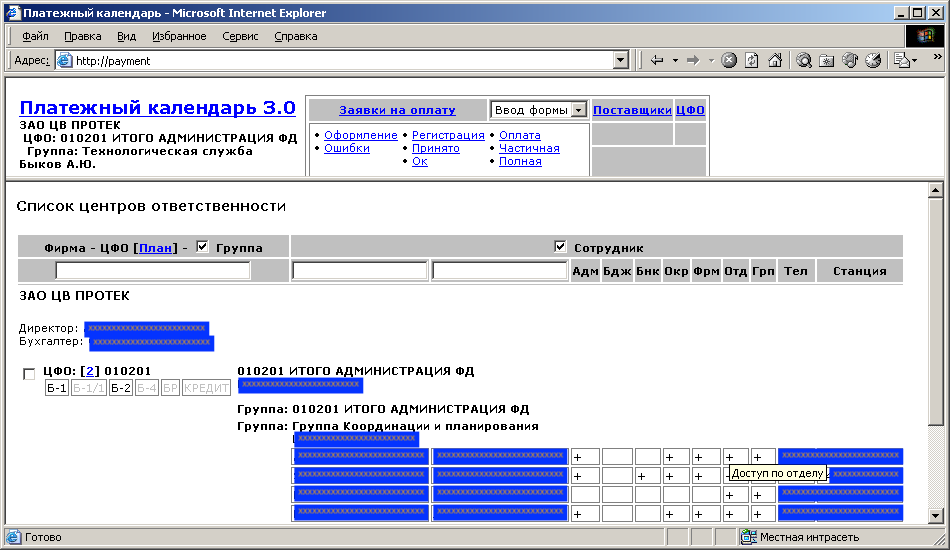

*******************
Платежный календарь
*******************

В период работы 2002-2006 старшим аналитиком в крупнейшем фармацевтическом дистрибьюторе ЗАО фирма "Центр Внедрения "ПРОТЕК" разработал казначейское приложение "Платежный календарь".

Процесс разработки состоял из анализа бизнес-процессов в ходе работы временной рабочей группы, проектирования и программирования базы данных и веб-приложения. 

Программа предназначена для автоматизации ведения бюджетно-контролинговой и расчетно-кассовой деятельности, представляет собой веб-приложение на технологии Microsoft ASP и базу данных на СУБД Oracle.

    Вид программы при запуске

Функционально программа состоит из 4=х модулей:

Заявки на оплату
================

    Оформление, согласование и мониторинг исполнения заявок на оплату.

Поставщики
==========

    Управление расчетными реквизитами контрагентов, контракты на поставку.

Структура и бюджет ЦФО
======================

    Оперативное планирование, корректирование и контроль превышения бюджета, управление структурой Центров Финансовой Ответственности.

Ведомость
=========

Управление остатками на расчетных счетах, планирование операций оплаты, обеспечения и перераспределения денежных средств на расчетных счетах.

